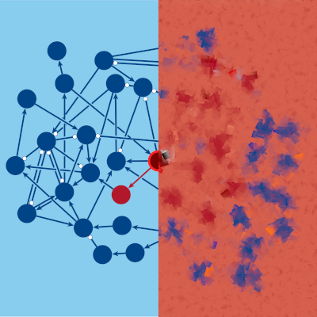
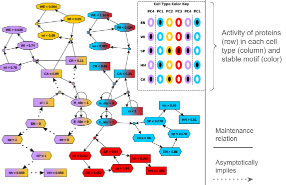
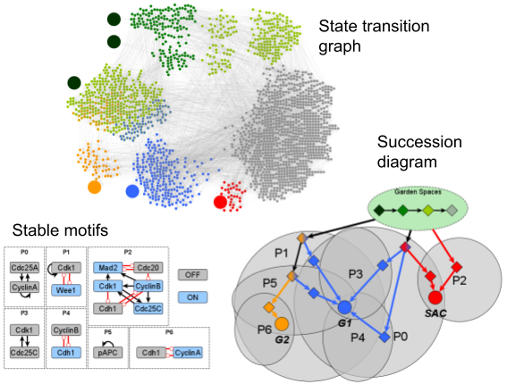

# Jordan Rozum

I am a postdoctoral research associate studying complex systems in the Complex Adaptive Systems & Computational Intelligence ([CASCI](https://casci.binghamton.edu/casci.php)) laboratory at Binghamton University. I have a math and physics background, and a research focus on applications to systems biomedicine and computational social science.

## Research Interests

**Current work: complex systems science, network dynamics and control theory, systems biology and biomedicine** 
*Previous work: galaxy modeling, airglow physics, differential geometry and Lie theory*

I have a math and physics background, and my current work focuses on applications of data science and dynamics to systems biology. Much of my work has been about how feedback loops in biological networks give rise to complex behaviors. I've applied these ideas in various contexts, including cell cycle regulation, pattern formation during embriogenesis, and immune cell signaling. I enjoy working with Boolean networks, which are discrete dynamical models popular in systems biology. 

I am the lead developer of the Python libraries [pystablemotifs](https://github.com/jcrozum/pystablemotifs) and [cubewalkers](https://github.com/jcrozum/cubewalkers), which together allow for fast attractor detection, control, and GPU-accelerated simulation in Boolean networks. I apply these methods to study the target control problem in experimentally-derived models and order-to-chaos phase transitions in random networks. 

Recently, I have also been developing methods to sparsify multi-layer networks while taking into account multiple data sources. I apply these methods to various problems in computational social science, health, and biomedical complexity.

### Highlights: Characterizing robust behaviors in cells

##### "Models of cell processes are far from the edge of chaos"  KH Park, FX Costa, LM Rocha, R Albert, JC Rozum  PRX Life 1, 023009, 2023

Powerful new simulations of cell processes models using our Python library [cubewalkers](https://github.com/jcrozum/cubewalkers) have revealed more robustness than previously proposed, challenging the prevailing "edge of chaos" theory (simulation code and results available [here](https://github.com/kyuhyongpark/cubewalkers-analysis)). The edge of chaos theory is based on the idea that life needs to adapt to its environment without being hypersensitive to it. If cells behave chaotically, then the tiniest errors can snowball into catastrophic--and fatal--failure. On the other hand, if they behave with rigid, crystalline order, then they are slow to adapt to changes in their environment. The edge of chaos is the critical point that separates these regimes and is thought to be the "sweet spot" where living systems operate. That was not the case here. In one of the largest databases of experimentally-supported cell process models, cells were able to recover from perturbations with much more resiliency than the edge of chaos hypothesis predicts. This suggests that, at least in the processes studied, life is willing to sacrifice some adaptive flexibility in favor of day-to-day robustness, challenging the notion that cells live life on the edge of chaos.

See the relevant paper [here](https://doi.org/10.1103/PRXLife.1.023009)

##### "Identifying (un) controllable dynamical behavior in complex networks"  JC Rozum and R Albert  PLoS Computational Biology 14 (12), 2018

We developed a formalism that identifies positive feedback loops
in ODE models that can "lock in", causing a system to commit to a restricted range of possible long-term behaviors. We used this
formalism to analyze the biomolecular decisions that lead to the formation of embryonic segments in the
fly (*Drosophila melanogaster*) and to uncover a self-reinforcing feedback loop in the biomolecular circuitry
that governs the response of T-cells to external signals. In both cases, we showed how these methods identify
manipulations of the system that can disrupt observed phenotypes and manipulations that cannot.
Apart from their utility in basic science research, observations of this nature have important potential applications 
in the development of pharmaceuticals
because they can narrow the (often very expensive) search for potential drug targets.

See the relevant paper [here](https://doi.org/10.1371/journal.pcbi.1006630).

### Highlights: Understanding the biomolecular decisions that cells make

##### "Parity and time-reversal elucidate both decision-making in empirical models and attractor scaling in critical Boolean networks"  JC Rozum, JGT Zañudo, X Gan, D Deritei and R Albert  Science Advances 7 (29), eabf8124, 2021

We developed the open-source Python library [pystablemotifs](https://github.com/jcrozum/pystablemotifs), 
which provides one of the world's fastest algorithms for attractor identification
and control in Boolean networks. This library uses parity and time reversal provide new insights into the key regulatory circuits that underpin the biochemical "decisions" that cells make. We used this tool to identify
the attractor repertoires of networks 80 times larger than ever before considered and thereby resolved a 50-year-old open problem about how stochasticity affects a cell's diversity of phenotypes. This was the
first time that stochastic genome-scale biomolecular models were analyzed in such detail. The results
of our analysis showed that the behaviors of traditional random models of gene regulation are
highly sensitive to stochasticity, suggesting biological selection pressures that are not accounted for in the canonical model.

See the relevant paper [here](https://doi.org/10.1126/sciadv.abf8124),
and a popular press summary [here](https://www.eurekalert.org/news-releases/583775).

## Research Experience

### Postdoctoral Research Associate 2022-Present, Binghamton University (SUNY) Dept. of Systems Science and Industrial Engineering
I am a current member of the Complex Adaptive Systems & Computational Intelligence ([CASCI](https://casci.binghamton.edu/casci.php)) laboratory lead by Professor Luis Rocha. I work on developing new tools and algorithms for analyzing complex networks in a variety of domains, including social media, biomedical data, and systems biology. I apply these tools to gain new insights into robustness and redundancy in biomedical systems from the cellular scale to the social scale.

### Graduate Research Assistant 2016–2022, Pennsylvania State University Dept. of Physics
Developing new network control approaches that generalize methods for discrete dynamics to continuous ODE network
models in collaboration with Professor Réka Albert. Apply network control theory to biological network models to better
understand decision mechanisms in cellular systems, identify potential drug targets, and predict results of biological
experiments.

### Graduate Research Assistant 2014-2016, Utah State University Dept. of Mathematics
Classification of homogeneous space-times according to their symmetries as part of Master’s Thesis advised by Professor
Ian Anderson and Professor Charles Torre. Devised a new coordinate-free classification scheme for Lie algebras of a
certain type relevant to homogeneous solutions to the Einstein equations and implemented the classification using the
DifferentialGeometry package of the computer algebra system Maple.

### Research Programmer, 2010-2014, Utah State University Dept. of Electrical Engineering

Data validation for the SABER (Sounding of the Atmosphere using Broadband Emission Radiometry) satellite instrument 
in collaboration with Professor Gene Ware and Professor Doran Baker. Analyzed SABER data, and maintained
the USU copy of the database. Focused on perceived bifurcation of hydroxyl airglow layer in the mesosphere.

### Undergraduate Research Fellow, 2010-2014, Utah State University Dept. of Physics

Examining bias in galaxy catalogs due to galaxy geometry in collaboration with Professor Shane Larson as part of USU’s
Undergraduate Research Fellowship. Wrote computer simulations of galaxy surface brightness. Performed statistical
analyses of galaxy catalogs to search for possible indications of observation bias.

## Education
#### Ph.D. in Physics from Pennsylvania State University, 2022
- Concentration: Network biophysics and dynamical systems
- Dissertation: Attractor identification and control of Boolean and ODE network models in Systems Biology
- Advisor: Professor Réka Albert

#### Master’s in Mathematics from Utah State University, 2016
- Concentration: Mathematical physics and differential geometry
- Thesis: Classification of Five-dimensional Lie Algebras with One-dimensional Subalgebras Acting as Subalgebras of the Lorentz Algebra
- Advisors: Professor Ian Anderson and Professor Charles Torre

#### Bachelor’s in Physics and Mathematics from Utah State University, 2014
- Magna Cum Laude
- Capstone project: Analyzing solutions to the Einstein equations using the Maple package DifferentialGeometry

## Honors, Awards, and Society Memberships
- PSU ICDS Featured Researcher ([link](https://www.icds.psu.edu/featured-researcher-jordan/)), 2021
- PSU Peter Eklund Memorial Lectureship Award Honorable Mention, 2019-2020
- PSU David Duncan Graduate Fellowship (**$1650**), 2019
- PSU Department of Physics David H. Rank Memorial Award (**$1200**), 2017
- PSU College of Science Roberts Scholarship Award (**$2000**), 2016
- USU Magna Cum Laude, 2014
- USU Physics Department Outstanding Senior, 2014
- Barry M. Goldwater Scholar (**$7500**), 2013
- Barry M. Goldwater Scholarship Honorable Mention, 2012
- USU A-Pin Award for Consecutive 4.0 Semesters, 2010-2014
- USU Undergraduate Research Fellow (**$4000**), 2010-2014
- USU Presidential Scholar (tuition & fees, approx. **$40,000**), 2010-2014
- Sigma Pi Sigma honor society member
- NetSci member

## Teaching Experience

#### Teaching Assistant, Pennsylvania State University Department of Mathematics 2016-2017
Course: Introductory Classical Mechanics

#### Course Instructor, Utah State University Department of Mathematics 2015
Course: Calculus II

#### Teaching Assistant, Utah State University Department of Mathematics 2015
Courses: College Algebra

#### Teaching Assistant, Utah State University Department of Physics 2013-2014
Courses: Introductory Physics I and II

#### Undergraduate Teaching Fellow, Utah State University 2011-2013
Courses: Advanced Classical Mechanics, Advanced Electromagnetism I and II

## Reviewer
Bioinformatics  
Biophysical Journal  
BMC Bioinformatics  
Journal of Complex Networks  
Mathematics in Science and Industry  
Mathematical Biosciences and Engineering  
Nature Communications  
npj Systems Biology and Applications  
Physica D: Nonlinear Phenomena  
PLOS Computational Biology  
Scientific Reports  

## Skills
Programming expertise in Python, additional completed projects using C++, CUDA, MATLAB/Octave, R, Rust, Sage, others  
Lead developer of pystablemotifs (Python) and cubewalkers (Python+CUDA) libraries  
Expertise in network science and discrete dynamical modeling  
Strong background in mathematics and algorithm development  
Experience with high-performance computing and managing large datasets

## Publications
#### _in preparation_
AM Marcus, **JC Rozum**, H Sizek, LM Rocha. CANA 1.0 and schematodes: efficient quantification of symmetry in Boolean automata (working title). *In preparation*.

Z Guo, J Felag, RB Correia, **JC Rozum**, LM Rocha. Selection of relevant patient cohorts from social media using the metric backbone of knowledge networks. *In preparation*.

**JC Rozum** and LM Rocha. The ultrametric backbone is the union of all minimum spanning forests. *In preparation*.

#### _submitted_
KH Park, **JC Rozum**, R Albert. From years to hours: accelerating model refinement. **Submitted**, *PLOS Computational Biology* (2023)

**JC Rozum**, C Campbell, E Newby, FSF Nasrollahi, R Albert. Boolean Networks as Predictive Models of Emergent Biological Behaviors. **Accepted**, *Cambridge Elements* (2023)

#### _published_
KH Park, FX Costa, LM Rocha, R Albert, **JC Rozum**. Models of cell processes are far from the edge of chaos. **Accepted**, *PRX Life* **1**, 023009 (2023)

R Li, **JC Rozum**, MM Quail, MN Qasim, SS Sindi, CJ Nobile, R Albert, AD Hernday. Inferring gene regulatory networks using transcriptional profiles as dynamical attractors. *PLoS Computational Biology* **19** (8), e1010991 (2023)

FX Costa, **JC Rozum**, AM Marcus, LM Rocha. Effective Connectivity and Bias Entropy Improve Prediction of Dynamical Regime in Automata Networks. *Entropy* **25** (2), 374, (2023)

**JC Rozum** and R Albert. Leveraging network structure in nonlinear control. *npj Systems Biology and Applications* **8**, 36 (2022)

**JC Rozum**. Attractor identification and control of Boolean and ODE network models in Systems Biology. PhD Dissertation in Physics, Pennsylvania State University (2022)

**JC Rozum**, D Deritei, KH Park, JGT Zañudo, R Albert. pystablemotifs: Python library for attractor identification and control in Boolean networks. *Bioinformatics* **38** (5), btab825 (2021)

**JC Rozum**, JGT Zañudo, X Gan, D Deritei and R Albert. Parity and time-reversal elucidate both decision-making in empirical models and attractor scaling in critical Boolean networks. *Science Advances* **7** (29), eabf8124 (2021)

**JC Rozum** and R Albert. Controlling the cell cycle restriction switch across the information gradient. *Advances in Complex Systems* **22** (07n08), 1950020 (2020)

D Deritei, **JC Rozum**, E Ravasz Regan, R Albert. A feedback loop of conditionally stable circuits drives the cell cycle from checkpoint to checkpoint. *Scientific Reports* **9** 16430 (2019)

**JC Rozum** and R Albert. Identifying (un) controllable dynamical behavior in complex networks. *PLOS Computational Biology* **14** (12) (2018)

**JC Rozum** and R Albert. Self-sustaining positive feedback loops in discrete and continuous systems. *Journal of Theoretical Biology* **459** 35-44 (2018)

**JC Rozum**. Classification of Five-dimensional Lie Algebras with One-dimensional Subalgebras Acting as Subalgebras of the Lorentz Algebra. Master's Thesis in Mathematics, Utah State University (2015)

J Price, **JC Rozum**, G Ware, and D Baker. Global Nightly OH and O2 Mesospheric Airglow: Examining a Decade of Measurements Using the NASA SABER Satellite Sensor. *Journal of the Utah Academy of Sciences, Arts, and Letters*, **91** (2014)

### Selected Talks and Poster Presentations

KH Park, FX Costa, LM Rocha, R Albert, **JC Rozum**. Robustness of biomolecular networks suggests functional modules far from the edge of chaos. *Talk* given at the International Conference on Systems Biology. Hartford CT, Oct. 10, 2023

F Xavier Costa, **JC Rozum**, AM Marcus and LM Rocha. Effective connectivity and bias entropy improve prediction of dynamical regime in automata networks. *Talk* given at the NetSci international conference. Vienna, Austria, Jul. 14, 2023

**JC Rozum**, JGT Zañudo, X Gan, D Deritei and R Albert. Parity and time-reversal in Boolean networks. *Poster* presented at the Cold Spring Harbor Laboratory Cellular Dyanamics and Models conference. Laurel Hollow, NY, May 19-21, 2021

**JC Rozum**. Boolean Networks: discrete dynamical models of high-dimensional nonlinear systems. *Invited talk* given at the University of Pennsylvania Mathematical Biology Seminar. Philadelphia, PA, Apr. 6, 2021

**JC Rozum**, JGT Zañudo, X Gan, and R Albert. Parity and time-reversal in Boolean networks. *Talk* given at the NetSci international conference. Rome, Italy, Sep. 25, 2020

**JC Rozum** and R Albert. Control robust trap spaces with applications to biomolecular networks. *Talk* given at the NetSci international conference. Burlington, VT, May 29, 2019

**JC Rozum** and R Albert. Identifying (un)controllable dynamical behavior with applications to biomolecular networks. *Invited talk* given at Pennsylvania State University Theoretical biology seminar. State College, PA, Feb. 20, 2018
